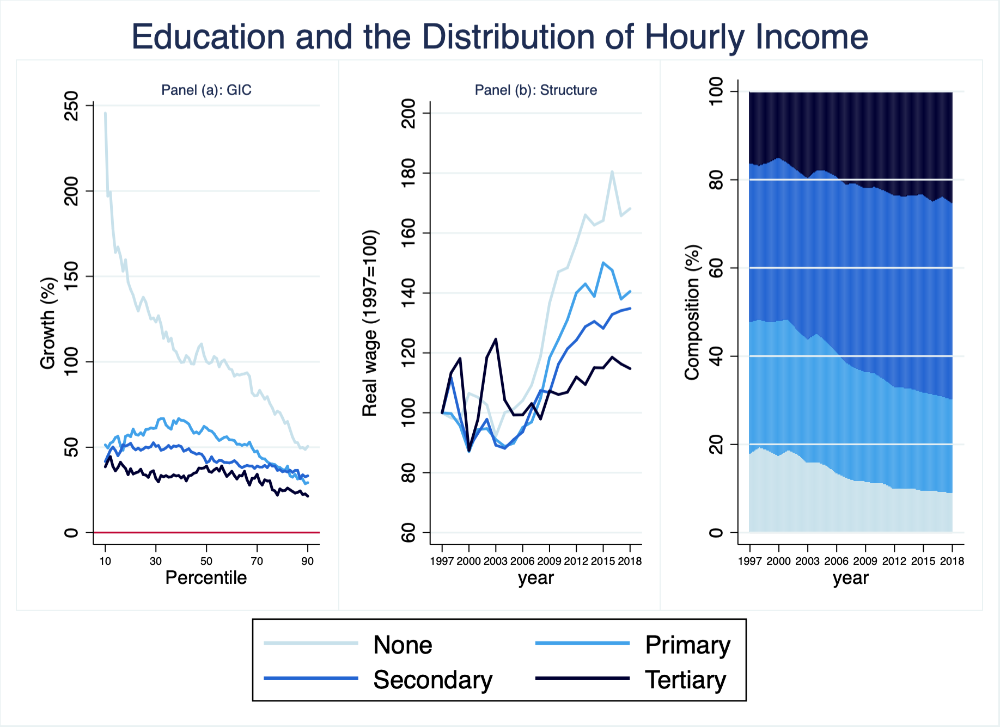

# ENAHO (1997-2017)
Authors: Sebastian Sardon

These programs create a dataset covering a large and nationally representative sample of Peruvian households over the 1997-2017 period. The raw data comes from Peru's National Household Survey (in Spanish, "ENAHO"), conducted by the National Institute of Informatics and Statistics (in Spanish, "INEI"). Notable studies that use this survey include Ñopo (RESTAT, 2008--Labor), Dell (Econometrica, 2010--Economic History), and Aragon and Rud (AEJ:EP, 2013--Natural Resources).

Instructions:\
    Step 1. Retrieve raw data from INEI's official webpage using the program "Scrap Enaho.py" [requires Python 3] \
    Step 2. Clean raw data using the program "data creator.do" [requires Stata]

Step 1's output can be downloaded [here](https://www.dropbox.com/sh/qvrws0dhshphcx6/AACOtIi1CXRA615O6L0n1QKYa?dl=0).

Information available from the authors at sebastiansardonbisso@gmail.com. Suggestions are welcome.

Here is an example of the information contained in the output dataset (Step 2):

